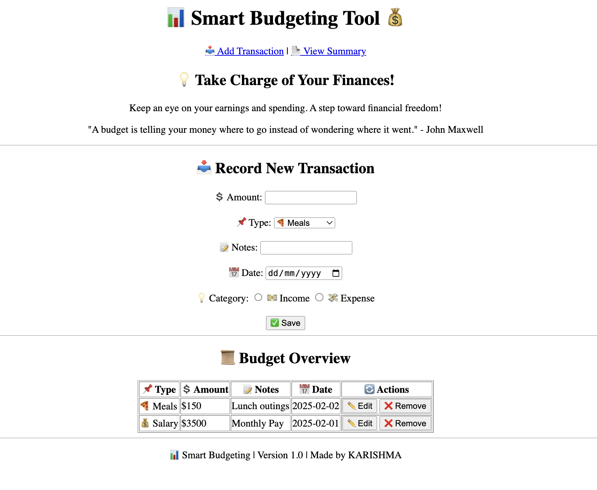

# ** Smart Budgeting Tool **
## ------ (HTML) Part : Assignment 1 ------

## 📌 **Overview**
This project was part of my internship at **Innomatics Research Labs**. For my first assignment, I created a simple **Smart Budgeting and Finance Tracker** using **HTML**. This web tool helps users track their expenses and income by adding transactions and viewing a basic summary.




## 🛠️ **Technologies Used**
- **HTML**: Used to create the structure and layout of the page.

## 🔑 **Features**
- **Add Transactions**: Users can record both income and expenses.
- **View Summary**: A table displays the recorded transactions and their details, such as amount, category, and date.
- **Basic Layout**: Simple, easy-to-use user interface with sections for adding transactions and viewing summaries.

## 💡 **Project Goal**
The goal of this project was to understand how to structure a basic webpage using HTML, create user input forms, and organize content in a meaningful way for tracking personal finances.

## 📂 **Project Structure**
```bash
/
├── html_code.html       # Main HTML file for the project
├── Results
│   └── Html_result.png # (Optional) Project screenshot image
├── README.md         # Project documentation
